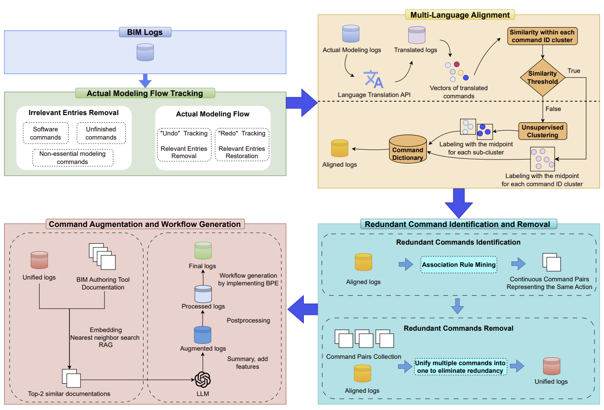

# Large-scale data filtering and enhancements
This repository is a comprehensive suite of Python scripts designed for Vectorworks data logs filtering and enhencement. The suite processes actual modeling flow tracking, multi-language alignment, redundant command identification and removal, command augmentation and workflow generation, providing a streamlined pipeline for log data analysis in Vectorworks. This repository also includes scripts for real-time log monitoring of Vectorworks logs. The overall workflow is illustrated in the following figure:



## Modules Overview

### `actual_modeling_flow_tracking_and_filtering`
This module processes and filters Vectorworks log data to extract the actual modeling flow while reducing unnecessary entries, corresponding to **Actual Modeling Flow Tracking**.

- **Input**:
  - BIM logs
- **Output**:
  - **Actual Modeling Logs**: Processed logs that reflect the true modeling usage logic.  
- **Dependencies**:  
   - pandas, tqdm, numpy, pyarrow

#### Key Script:
- `prefiltering_groupby.py` :Prefilter the raw log to remove irrelevant entries and tracks redo/undo operations to keep the true usage logic. It also save the data into smaller chunks to reduce the RAM usage for downstraem processing.


### `multi_language_alignment`
This module ensures global compatibility by handling multilingual data entries, corresponding to **Multi-Language Alignment**.

- **Input**:
  - **Actual Modeling Logs**  
- **Output**:
  - `command_dictionary.csv` : A mapping of original logs to their translated counterparts (English).
- **Dependencies**:  
  - pandas, tqdm, google-cloud, google-api-core, voyageai, numpy, scikit-learn, scikit-optimize  

#### Key Scripts:

- `Preprocessing.ipynb`: 
      Utilizes Google Translate AIP convert non-English log entries into English.
  
- `embedding_clustering.ipynb`:
      Convert english logs to vector, unsupervised classification is implemented for further clustering, and the representation of the logs is unified based on the clusters.
  
  
### `redundant_command_identification_and_removal`
This module focuses on identifying relationships between high-level and low-level commands using Association Rule Mining, corresponding to **Redundant Command Identification and Removal**.
- **Input**:  
  - **Actual Modeling Logs**  
  - `command_dictionary.csv`  
- **Output**:  
  - `command_pairs_collections.csv`: A mapping of high-level and low-level commands validated within the Vectorworks software environment.  
- **Dependencies**:  
  - pandas, tqdm, numpy  


#### Key Scripts:
- `mapping_sup_calculation.ipynb`: 
      Unifies language representation using `command_dictionary.csv`, then calculates the support of high-low level command pairs and the support of high-level commands in the log dataset. Each high-level command forms five high-low level command pairs with its subsequent five low-level commands based on time sequence.

- `confidence_calculation_and_filtering.ipynb`: 
      Computes the confidence of each high-level command in relation to specific low-level commands. Applies rule-based filtering to generate a high-low command mapping.

**NOTE:** A manual check was conducted in the BIM authoring tool Vectorworks to further refine the mapping of different high-level and low-level commands to ensure alignment with the various modes of the tools.  


### `command_augmentation_and_workflow_generation`
This module expands command-related information using Retrieval-Augmented Generation (RAG). It applies Byte Pair Encoding (BPE) for workflow generation, corresponding to **Command Augmentation and Workflow Generation**.
- **Input**:  
  - **Aligned Logs**  
  - **BIM Authoring Tool Documentation** (Markdown format)
- **Output**:  
  - **Final Logs**: Log files containing officially sourced information and frequently occurring merged workflows.
- **Dependencies**:  
  - pandas, tqdm, numpy, openai, sentence-transformers, langchain-community, tenacity, torch, tiktoken

#### Key Scripts:
- `log_processing.ipynb`  
  Extracts command names and merges commands that have the same name but different IDs, removes noise logs based on command names that are meaningless, filters out infrequent logs.

- `openai_sideinformation.py`  
   Utilizes Chroma and OpenAI API to generate meta-information for commands based on official documentation and command names.

- `bpe_workflow_merging.ipynb`  
   Implements Byte Pair Encoding to generate command workflows and expand the existing vocabulary.


## Getting Started

The following process is a step-by-step implementation of the scripts for BIM log filtering and enhancement.

### Step 1. Preprocess Log Data
Run the `actual_modeling_flow_tracking_and_filtering` module to preprocess log data to get **Actual Modeling Logs**.

**Input:**  **BIM Logs**

**Output:** **Actual Modeling Logs**

- Execute the following script:
  ```sh
  python actual_modeling_flow_tracking_and_filtering/prefiltering_groupby.py
  ```

### Step 2. Multi-Language Alignment 

Run the `multi_language_alignment` module to generate the **command dictionary**, which requires **Actual Modeling Logs** as input. These logs are the output from **Step 1**.  

**Input:**  **Actual Modeling Logs**

**Output:** `command_dictionary.csv`

#### 2.1 Translate the Unique Log Dataset to English
- Open and run the following Jupyter notebook:
  ```sh
  jupyter notebook multi_language_alignment/Preprocessing.ipynb
  ```
  - Requires a **Google Translate API key** to run.
    
#### 2.2 Process the Translated Log Dataset by Embedding and Clustering
- Run the following Jupyter notebook:
  ```sh
  jupyter notebook multi_language_alignment/embedding_clustering.ipynb
  ```
  - Requires a **Voyage AI API key** to run.
    
The dataset will undergo embedding and clustering. Based on the similarity within each cluster, entries will either be further refined or assigned a unified name for specific log entries.
The final output will be a custom language dictionary `command_dictionary.csv` that maps original command names to their corresponding unified log names.


### Step 3. Identify and Remove Redundant Commands
Run the `redundant_command_identification_and_removal` module to generate **high-level and low-level command mappings**, which requires **Actual Modeling Logs** from **Step 1**  and `command_dictionary.csv` from **Step 2** as input

**Input:**  **Actual Modeling Logs**, `command_dictionary.csv`

**Output:** `command_pairs_collections.csv`

#### 3.1 Compute Support for Command Pairs
- Run the following Jupyter notebook:
  ```sh
  jupyter notebook redundant_command_identification_and_removal/mapping_sup_calculation.ipynb
  ```
  - Ensure that the input paths for Actual Modeling Logs and command_dictionary.csv are correctly set.

#### 3.2 Calculate Confidence and Filter Results
- Run the following Jupyter notebook:
  ```sh
  jupyter notebook redundant_command_identification_and_removal/confidence_calculation_and_filtering.ipynb
  ```
#### 3.3 Manual Review
- Manually review the Vectorworks software to validate ambiguous command mappings requiring further refinement.


### Step 4. Log Filtering

This step performs the **filtering algorithm** based on the generated `command_dictionary.csv` from **Step 2** and `command_pairs_collections.csv` from **Step 3** to apply **language alignment** and **redundant entry removal** for the **Actual Modeling Logs** from **Step 1**.

**Input:**  **Actual Modeling Logs**, `command_dictionary.csv`, `command_pairs_collections.csv`

**Output:** **Aligned Logs**

#### Process:

- Ensure the correct paths are set for:  
  - `command_dictionary.csv`  
  - `command_pairs_collections.csv`  

- Run the following Jupyter notebook:
  ```sh
  jupyter notebook log_filtering.ipynb
  ```

This notebook translates the log dataset following the **Multi-Language Alignment** module and applies the filtering process from **Redundant Command Identification and Removal**.

### Step 5. Command Augmentation and Workflow Generation

**Input:**  **Aligned Logs**, **BIM Authoring Tool Documentation** (Markdown format)

**Output:** **Final Logs**, Log files containing officially sourced information and frequently occurring merged workflows.

#### 5.1  **Aligned Logs** preprocessing

- Run the following Jupyter notebook:
   ```sh
  jupyter notebook  command_augmentation_and_workflow_generation/log_processing.ipynb
   ```
   - The preprocessing extract command names and removes noise from log data.

#### 5.2  Workflow generation by implementing BPE

- Run the following Jupyter notebook:
   ```sh
   jupyter notebook command_augmentation_and_workflow_generation/bpe_workflow_merging.ipynb
   ```
   - Expands the vocabulary by merging the most frequent logs to form workflows.


#### 5.3  Implement RAG for Information Retrieval

- Run the following script:

   ```sh
  python  command_augmentation_and_workflow_generation/openai_sideinformation.py
   ```

   - Implements Retrieval-Augmented Generation (RAG) to retrieve relevant information from the official Vectorworks documentation.
   - Summarizes the retrieved information using the OpenAI API.
   - Requires an **OpenAI API key** to run.

# Local log-watcher

To test the effectiveness of the data processing pipeline, we implemented a local log watcher to poll and monitor the Vectorworks log file in real time.
Please refer to the `prototype` folder for more details.


