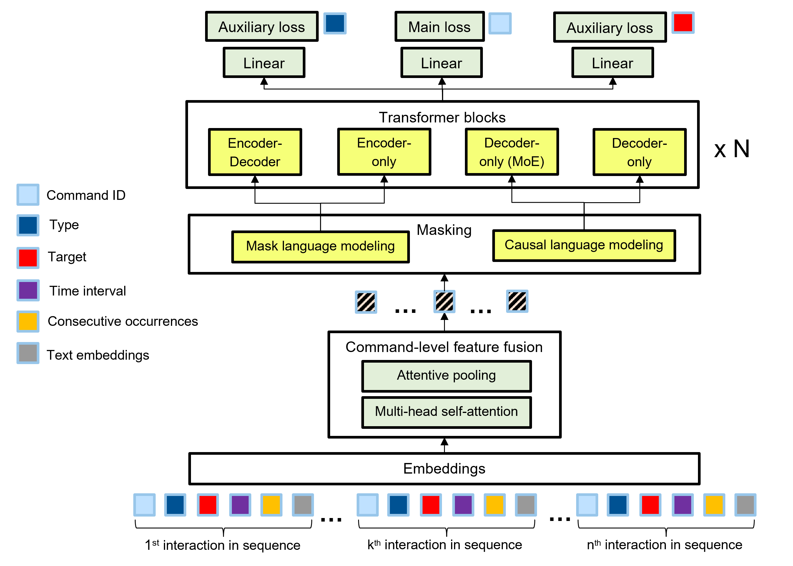

# Model training and evaluation

This code base contains code for dataset creation and split, feature engineering, model training and evaluation. All experiments were run on a linux machine.

## Run in tmux
```
# create a new screen session
tmux new -s training bash

# detach session to main terminal
Ctrl + B, then press D

# list all session
tmux ls

# reenter the session
tmux attach -t training

# terminate the session
tmux kill-session -t training

# to know whether you are in tmux or not
echo $TMUX -> give no none value then you are in tmux!
```
## Dataset creation, split and feature engineering
`model/preprocess.py` takes the processed data from `data_processing`, convert command meta-information to features and store the feature engineering workflow, and finally create the train and eval datset.

`model/pretrained_text_embedding.py` uses pretrained text embedding model to convert LLM-augmented command descriptions to text embeddings, store them on disk so that the model can query them during training & inference. You need to set your OPENAI_API_KEY in `.env`.

## Model training and evaluation



`model/train_eval_baseline_models.py` provides training and evaluation script for baseline models, where we removed additional modules proposed in our model like feature fusion, multi-task learning and focal loss.

`model/train_eval_full_models.py` provides training and evaluation script for models proposed in the paper. 
We also provide QLoRA (https://arxiv.org/abs/2305.14314) based method to fine tune model with large transformer backbone like Llama3.2-1B or Llama2-7B. The QLoRA is implemented in `peft/`. This is a custom fork from the original HF peft repo (https://github.com/huggingface/peft), in which we have made some adjustments so that QLoRA, which was originally designed for language models, can be used on the model architecture we propose.

Our model architecture is implemented based on `transformers4rec/`, which is a customized version of original `t4rec` repo (https://github.com/NVIDIA-Merlin/Transformers4Rec). 

Some major changes:
- Different types of feature fusions are defined in `transformers4rec/torch/features/sequence.py`
- Multi-task learning, Focal loss, and auxiliary loss for balancing MoE experts routing are defined in `transformers4rec/torch/model/prediction_task.py`
- New LLM architectures and LoRA support are introduced in `transformers4rec/config/transformer.py` and `transformers4rec/torch/block/transformer.py`
- Logic for handeling addtional labels and solving bugs in orginal CLM masking (https://github.com/NVIDIA-Merlin/Transformers4Rec/issues/765) are in `transformers4rec/torch/masking.py`

Some minor changes:
1. Add labels = None in LlamaModel.forward()
2. In `transformers4rec/torch/model/base.py` add some dummy config and prepare generation function
3. change the _pad_dense_tensor in `transformers4rec/torch/utils/padding.py`
4. Remove use_cuda_amp in `transformers4rec/torch/trainer.py`
