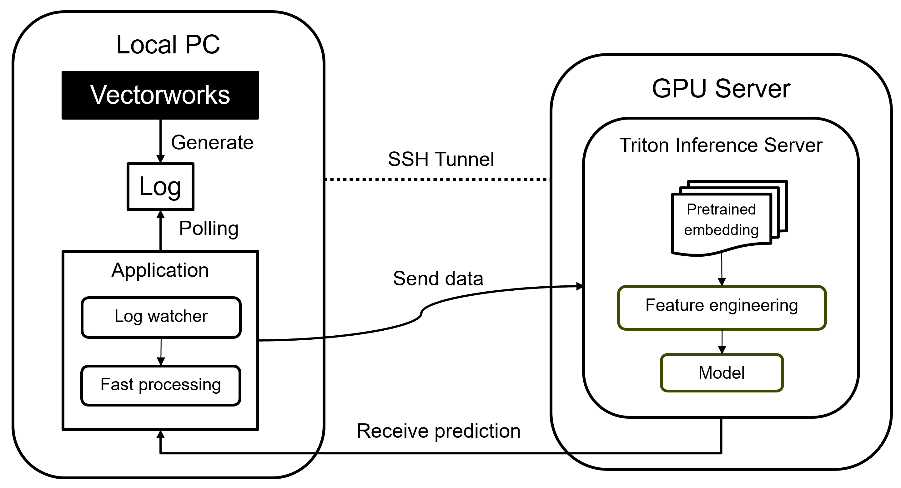

# Prototype integration
We implemented a web application based on fastapi and vue.js that is deployed on the local computer running Vectorworks. The prototype polls the log in real time, transfers the data to a remote inference server, and dynamically displays the inference result on the front end.



Please note that we deploy this prototype on WSL.

# Getting start

## Open ssh tunnel for sending requests via VPN
```
# should open this in wsl, keep it open, so we can use localhost:9999 in local pc to access the remote inference endpoint we deployed on Triton server.

ssh -L 9999:localhost:<endpoint_port> <user_name>@<remote_IP_address>
```

## Start frontend

### For Setup
```sh
# install node.js, then
cd prototype/web_application/frontend
npm install
```
### Compile and Hot-Reload for Development

```sh
npm run dev
```
### Compile and Minify for Production

```sh
npm run build
```

## Start backend
Launch the fastapi in `prototype/web_application/fastapi/log_watcher.py`.

The backend uses the filtering functions defined in `prototype/web_application/fastapi/fast_filtering.py`. The filering requires **data/commands_dictionary.csv**, **data/command_pairs_collections.csv**, **data/combined_merged_message_counts_with_meanings_openai.csv**, and **data/vocabulary.json(1226_voc_10workflow.json)** obtained from `data_processing/multi_language_alignment`, `data_processing/redundant_command_identification_and_removal`, `data_processing/command_augmentation_and_workflow_generation/openai_sideinformation`, and `data_processing/command_augmentation_and_workflow_generation/bpe_workflow_merging.ipynb`, respectively.

In addtion, the backend also needs `categories` and `data/workflow_etl_new_data_1226_latest` outputted by finishing the dataset construction in `model/preprocess.py`.

Please make sure that you have set the correct path to the above files in `prototype/web_application/fastapi/log_watcher.py`. You also need to locate your Vectorworks log file, which is typically stored in the `/mnt/c/Users/xxx/AppData/Roaming/Nemetschek/Vectorworks/2024/VW User Log.txt`.

You also need to configure the inference endpoint in `.env`, which is required for functions in `prototype/web_application/fastapi/inference_request.py`. The backend use the funtions to send/receive data to inference server. 

### numba cuda problem on windows WSL
There might be errors when import nvtabular like "numba.cuda.cudadrv.error.CudaSupportError: Error at driver init: Call to cuInit results in CUDA_ERROR_NO_DEVICE (100)". Solution:
```
export LD_LIBRARY_PATH="/usr/lib/wsl/lib/"
```

---

## Local log-watcher

We also provide a lightweight script `local_log_watcher.py` that actively watches Vectorworks log files for updates, triggering fast data processing defined in `prototype/web_application/fastapi/fast_filtering.py` when changes are detected.

This script can be used to validate the  data filtering and enhancement pipline.
Similiar to backend `prototype/web_application/fastapi/log_watcher.py`, please make sure that the above mentioned path are correctly set.

```sh
python VW_local_log_watcher/local_log_watcher.py
```
