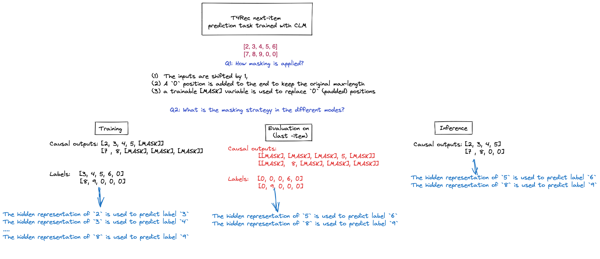
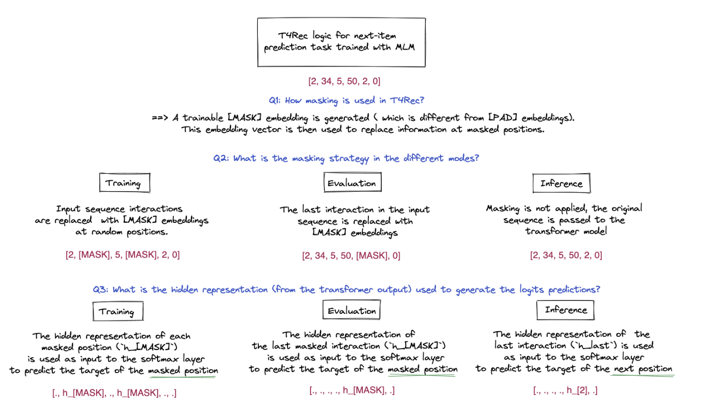
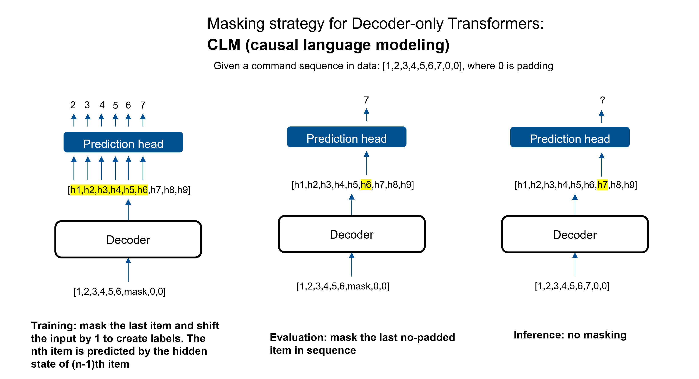
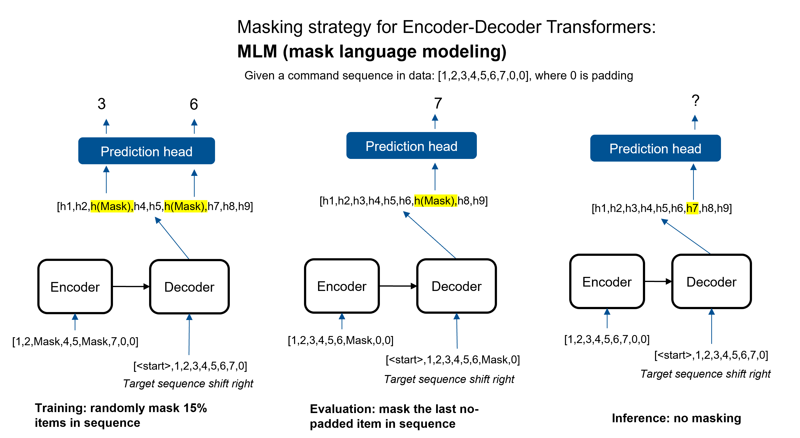
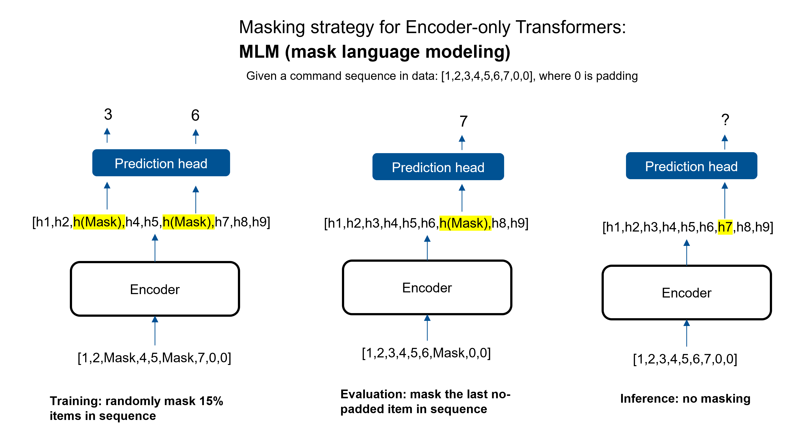

# Transformer4rec
This is a customized version of the original t4rec repo https://github.com/NVIDIA-Merlin/Transformers4Rec. The changes are documented in `model/README.md`.

Some helpful visuals for understanding the masking strategies used in the model:

Causal Language Modeling (CLM):

Masked Language Modeling (MLM):

## Masking in different types of Transformers
Decoder-only

Encoder-Decoder

Encoder-only

